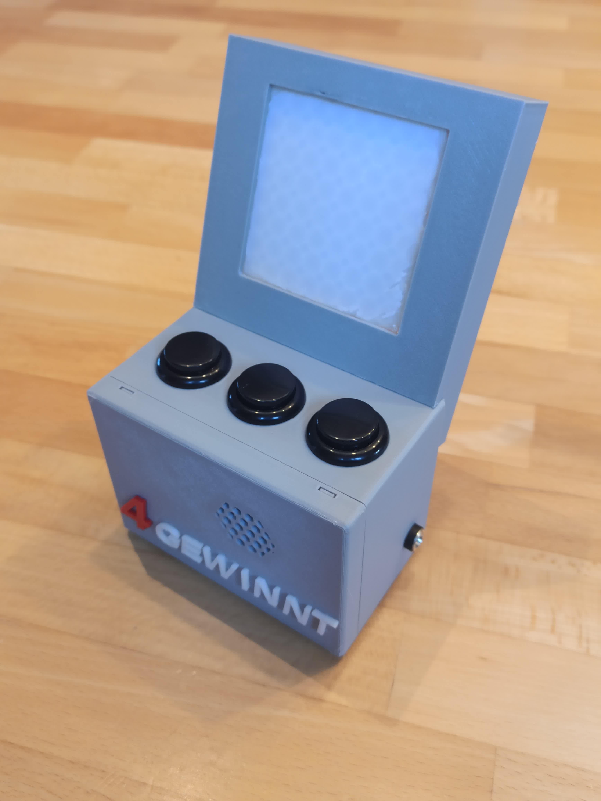

# 4 Gewinnt

## Einleitung

‘4 Gewinnt’ ist ein Spiel für 2 Spieler (ROT und BLAU), die abwechselnd Spielsteine in eine von 8 Reihen fallen lassen. Wer als erster 4 Steine seiner Farbe waagerecht, senkrecht oder diagonal angeordnet hat, hat das Spiel gewonnen.

## Spielablauf

Der Spieler ROT beginnt. Er positioniert mit der linken und rechten Taste den Spielstein. Mit der mittleren Taste lässt er den Spielstein fallen. Der Spielstein fällt so weit nach unten bis er auf den Boden oder einen bereits vorhandenen Spielstein fällt. Nun ist der Spieler BLAU an der Reihe 

Ziel ist es, 4 Steine der eigenen Farbe in einer Reihe waagerecht, senkrecht oder diagonal anzuordnen und den Gegner daran hindern, dass er 4 Steine in Reihe legen kann.

## Hardware

* Arduino Nano,
* 1 x Neopixel LED Matrix (8x8 LEDs)
* 3 x Arcade Buttons 20mm
* 5-7V Netzteil mit 2.1mm Hohlstecker
* 1 x Minilautsprecher
* 1 x Kondensator 1µF
* 1 x 2.1mm Power Buchse
* 1 x Lochraster Platine 5x7cm, 
* isolierter Draht
* 3D gedruckte Teile

## Links
* https://www.instructables.com/Connect-4-Game-Using-Arduino-and-Neopixel/ 

