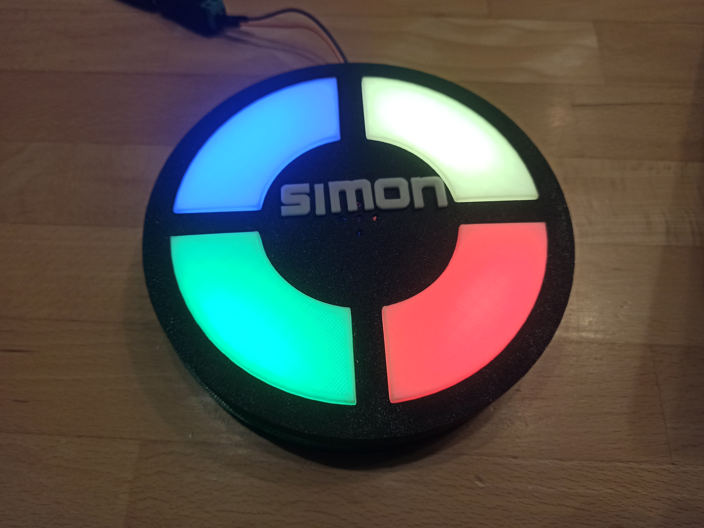

# Simon

## Einleitung

Simon, das Kultspiel aus den 70ern ist zurück. Wiederhole die Ton- und Lichtfolge die der Computer vorgibt. Die Folge wird mit der Zeit immer länger und die Zeit, mit der die Töne abgespielt werden, immer kürzer. Schaffst du es bis Level 99?

## Spielablauf

Das Spiel startet nach Drücken des Tasters an der Seite des Spiels mit einer kurzen Melodie (erkennst du die Melodie?). Danach beginnt Level 1 mit einer zufälligen Ton/Farbe. Drücke auf die entsprechende Farb Taste. Die Tasten sind Touchtasten und brauchen nur ganz leicht berührt werden.

Wurde die Ton/Farb Folge richtig eingegeben, blinken alle Tasten kurz GRÜN und es wird ein weiterer Ton an die Folge angehängt. Die komplette Ton/Farb Folge wird wieder ausgegeben, dann bist du an der Reihe die Folge zu wiederholen.

Wurde die Ton/Farb Folge falsch eingegeben, blinken alle Tasten ein paar mal ROT. Danach wird das erreichte Level angezeigt. Dazu blinken alle Tasten BLAU für die 10er Stelle (falls Level 10 oder mehr erreicht wurde). Anschließend blinken alle Tasten GELB entsprechend der 1er Stelle des Levels. 

Danach beginnt das Spiel von vorne mit einer neuen Sequenz.

## Hardware

* Arduino Nano,
* 4 x Neopixel LED Stick (8 LEDs)
* 4 x TTP223 Touch Sensor
* 1 x Minilautsprecher
* 1 x Kondensator 1µF
* 5-7V Netzteil mit 2.1mm Hohlstecker
* 1 x Taster
* 1 x 2.1mm Power Buchse
* 1 x Lochraster Platine 5x7cm, 
* isolierter Draht
* 3D gedruckte Teile

## Links

* https://www.instructables.com/Memory-Game-With-Touch-Simon-Says-If-This-Then-Tha/ 
